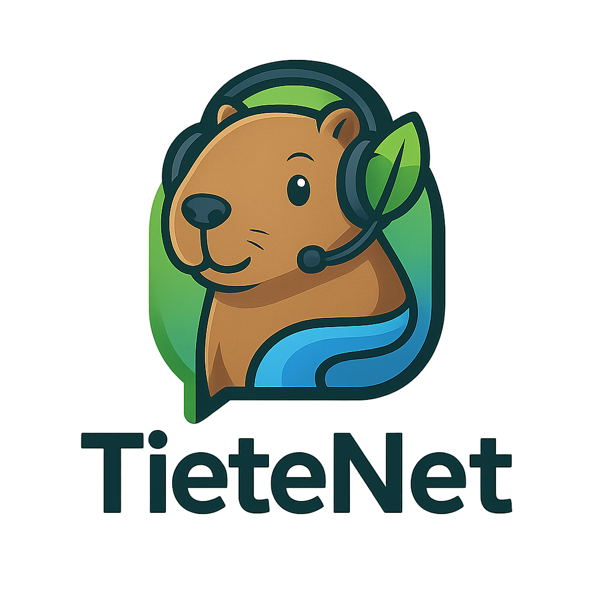
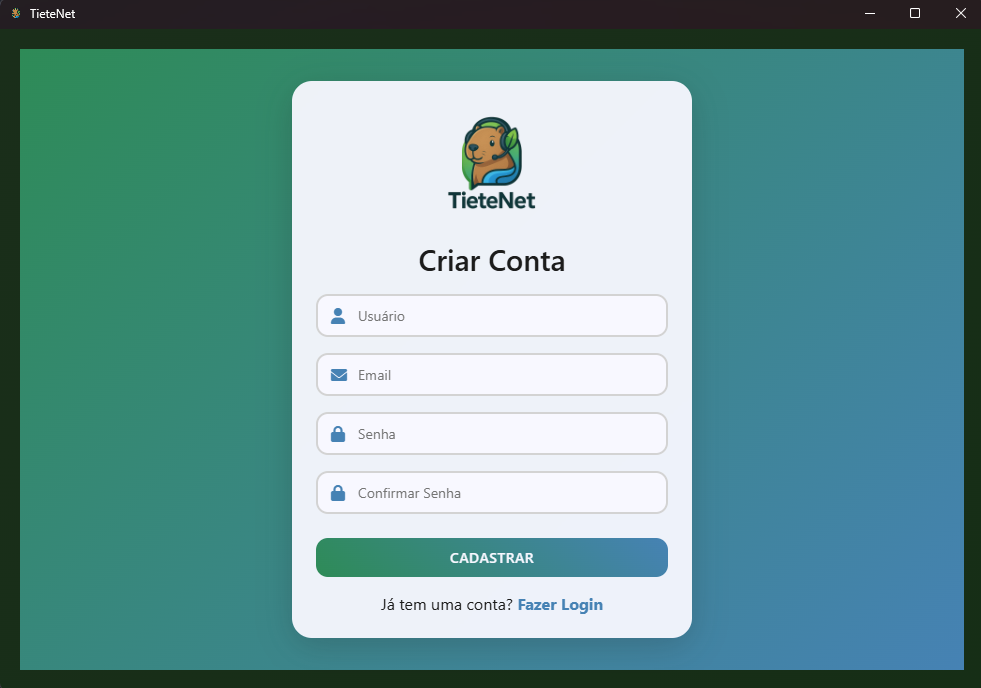
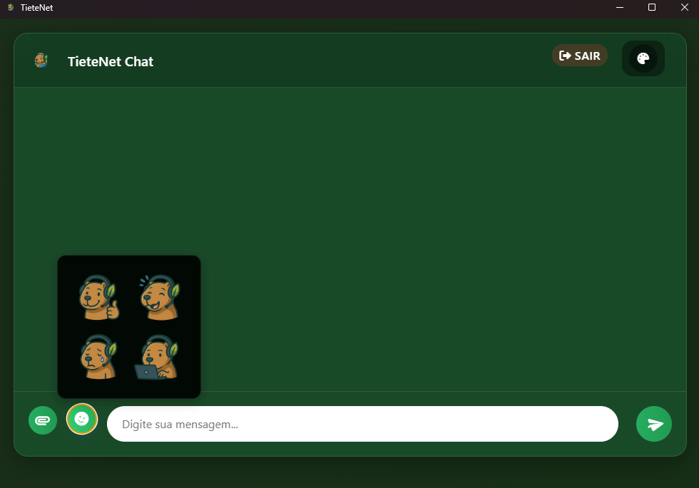

# 💬 TieteNet Chat

<div align="center">
  
  <br/>
  <p><i>Um chat moderno e elegante desenvolvido com Python e Electron</i></p>
</div>

## ✨ Características

### Interface Moderna
- 🎨 5 temas diferentes (Escuro, Claro, Azul, Verde, Roxo)
- 💅 Design responsivo e intuitivo
- 🌟 Animações suaves
- 😊 Suporte a emojis e figurinhas

### Funcionalidades
- 🔐 Sistema de autenticação seguro
- 📁 Compartilhamento de arquivos
- 📸 Preview de imagens
- 💾 Histórico de mensagens
- 👥 Suporte a múltiplos usuários
- 🔄 Conexão em tempo real via WebSocket

## 🛠️ Tecnologias

### Backend
-  Python 3.x
-  Flask
-  MySQL
-  WebSocket

### Frontend
-  Electron
-  HTML5
-  CSS3
-  JavaScript

## 🚀 Instalação

### Requisitos Prévios
- Python 3.x
- Node.js
- MySQL Server
- Git

### Configuração do Backend
```bash
# Clone o repositório
git clone https://github.com/seu-usuario/APS-5Semestre.git
cd APS-5Semestre

# Configure o ambiente virtual Python
python -m venv venv
source venv/bin/activate  # Linux/Mac
# ou
.\venv\Scripts\activate  # Windows

# Instale as dependências
cd server
pip install -r requirements.txt

# Configure o banco de dados
mysql -u root -p < database_setup.sql

# Inicie o servidor
python app.py
```

### Configuração do Frontend
```bash
# Na pasta do projeto
cd chat-client

# Instale as dependências
npm install

# Inicie o cliente
npm start
```

## 📸 Screenshots

<div align="center">
  
  
  
</div>

## 🔧 Configuração

### Variáveis de Ambiente
```env
DB_HOST=localhost
DB_USER=root
DB_PASS=sua_senha
DB_NAME=chatAps
```

## 👥 Contribuição
Contribuições são bem-vindas! Por favor, leia as [diretrizes de contribuição](CONTRIBUTING.md) antes de submeter um Pull Request.

## 📝 Licença
Este projeto está licenciado sob a Licença MIT - veja o arquivo [LICENSE](LICENSE) para detalhes.

---
<div align="center">
  <p>Desenvolvido com ❤️ pela equipe TieteNet</p>
</div>
